# PayFlow - Architecture Diagrams

This document contains Mermaid diagrams for visualizing PayFlow's architecture on GitHub.

## System Architecture

```mermaid
graph TB
    subgraph "Client Layer"
        A[React Frontend<br/>Port 3000]
    end
    
    subgraph "API Layer"
        B[Node.js API Gateway<br/>Port 3001<br/>JWT Auth | Rate Limiting]
    end
    
    subgraph "Service Layer"
        C[Go Ledger Service<br/>Port 8080<br/>ACID Transactions]
    end
    
    subgraph "Data Layer"
        D[(PostgreSQL 15<br/>Primary Database)]
        E[(Redis 7<br/>Cache & Sessions)]
        F[Logging<br/>Winston | Logrus]
    end
    
    A -->|HTTPS/REST| B
    B -->|HTTP| C
    C --> D
    C --> E
    B --> D
    B --> E
    C --> F
    B --> F
    
    style A fill:#6366f1,stroke:#4f46e5,color:#fff
    style B fill:#10b981,stroke:#059669,color:#fff
    style C fill:#f59e0b,stroke:#d97706,color:#fff
    style D fill:#3b82f6,stroke:#2563eb,color:#fff
    style E fill:#ef4444,stroke:#dc2626,color:#fff
    style F fill:#8b5cf6,stroke:#7c3aed,color:#fff
```

## Transfer Flow Sequence


## Authentication Flow


## Database Entity Relationship


## Deployment Architecture


## Error Handling Flow


## Caching Strategy


## State Management (Frontend)


## CI/CD Pipeline

```mermaid
graph LR
    A[Git Push] --> B[GitHub Actions]
    
    B --> C[Run Tests]
    C --> D{Tests Pass?}
    D -->|No| E[Notify Developer]
    D -->|Yes| F[Build Docker Images]
    
    F --> G[Push to Registry]
    G --> H{Branch?}
    
    H -->|main| I[Deploy to Production]
    H -->|develop| J[Deploy to Staging]
    H -->|feature| K[Deploy to Dev]
    
    I --> L[Health Check]
    J --> L
    K --> L
    
    L --> M{Healthy?}
    M -->|Yes| N[Success ✓]
    M -->|No| O[Rollback]
    
    style N fill:#10b981,stroke:#059669,color:#fff
    style E fill:#ef4444,stroke:#dc2626,color:#fff
    style O fill:#f59e0b,stroke:#d97706,color:#fff
```



---

## How to View These Diagrams on GitHub

1. GitHub automatically renders Mermaid diagrams in Markdown files
2. Simply view this file on GitHub to see all diagrams
3. Diagrams are interactive and can be zoomed/panned
4. Dark mode is automatically supported

## Embedding in Other Documents

To embed these diagrams in your README or other docs, simply copy the Mermaid code blocks:

````markdown

````

GitHub will render them automatically! 🎉
